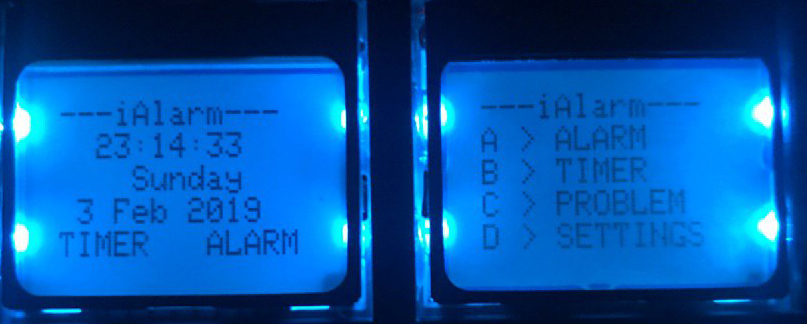

# iAlarm
  This alarm will help to wake you up at any time of the day.
  It's also built-in timer there.
## Getting started

### Prerequisites
  * STM32F411xxx
  * 2 Nokia Displays
  * DS3231
  * Matrix Keyboard
  * Sound system
  * Micro-USB
  
### Devices

#### RTC(Real-time clock)

Functions: 
  * Store time
  * Store alarms
Realization:
  * Library was written by ourselves(located in the "rtc.c" file);
  * Connected via I2C;
  * The back up battery can work for more than 30 years.

#### Display

Information on the display:<br>
**1st display**:
  * Current time
  * Day of the week
  * Date
  * Timer status
  * Alarm status

**2nd display**:
  * Navigation

Realization:
  * Already written library by indrekis
  * Connected via SPI
  
#### Keyboard

Functions:
  * Set the alarm and the timer on the 2nd display;
  * Repeats of the alarm
  * Set the time and date

Realization:
  * Works via interrupts
  
#### Audio System

Functions:
  * Wake you up

Speciality:
  * Multiplying complex numbers, you will become smarter
  

### Installing
  ```bash
  $ git clone https://github.com/chernetskyi/iAlarm  
  ```
  1. Take the STM32F411xxx.
  2. Connect all details in the following way:
  
  2. Open the iAlarm project in the System Workbench or Keil.<br>
  3. Build and run the project.

### Checking
  If you see the following on your displays:<br>
  <br>
  (The time and date can be different), than you successfully connected the "iAlarm"
  
### Structure of the project
.
├── CODE_OF_CONDUCT.md <br>
├── LICENSE <br>
├── README.md <br>
├── code <br>
│   ├── 32F411EDISCOVERY.xml <br>
│   ├── Drivers <br>
│   │   ├── CMSIS <br>
│   │   │   ├── Device <br>
│   │   │   │   └── ST <br>
│   │   │   │       └── STM32F4xx <br>
│   │   │   │           └── Include <br>
│   │   │   │               ├── stm32f411xe.h <br> 
│   │   │   │               ├── stm32f4xx.h <br>
│   │   │   │               └── system_stm32f4xx.h <br>
│   │   │   └── Include <br>
│   │   │       ├── A lot of includes <br>
│   │   └── STM32F4xx_HAL_Driver <br>
│   │       ├── Inc <br>
│   │       │   ├── Legacy <br>
│   │       │   │   └── stm32_hal_legacy.h <br>
│   │       │   ├── Includes for i2c, spi, timers.. <br>
│   │       └── Src <br>
│   │           └── Files for i2c, spi, timers.. <br>
│   ├── Inc <br>
│   │   ├── Backup <br>
│   │   │   └── Backups for all files <br>
│   │   ├── font6x8.h <br>
│   │   ├── gpio.h <br>
│   │   ├── i2c.h <br>
│   │   ├── interface.h <br>
│   │   ├── keyb.h <br>
│   │   ├── lcd5110.h <br>
│   │   ├── lcd5110_hal.h <br>
│   │   ├── lcd5110_ll.h <br>
│   │   ├── main.h <br>
│   │   ├── problem.h <br>
│   │   ├── queue.h <br>
│   │   ├── rtc.h <br>
│   │   ├── spi.h <br>
│   │   ├── stm32f4xx_hal_conf.h <br>
│   │   └── stm32f4xx_it.h <br>
│   ├── STM32F411VETx_FLASH.ld <br>
│   ├── Src <br>
│   │   ├── Backup <br>
│   │   │   └── Backups <br>
│   │   ├── gpio.c <br>
│   │   ├── i2c.c <br>
│   │   ├── interface.c <br>
│   │   ├── keyb.c <br>
│   │   ├── lcd5110.c <br>
│   │   ├── lcd5110_hal.c <br>
│   │   ├── lcd5110_ll.c <br>
│   │   ├── main.c <br>
│   │   ├── problem.c <br>
│   │   ├── queue.c <br>
│   │   ├── rtc.c <br>
│   │   ├── spi.c <br>
│   │   ├── stm32f4xx_hal_msp.c <br>
│   │   ├── stm32f4xx_it.c <br>
│   │   └── system_stm32f4xx.c <br>
│   ├── code\ Run.cfg <br>
│   ├── code.ioc <br>
│   ├── startup <br>
│   │   └── startup_stm32f411xe.s <br>
│   └── syscalls.c <br>
└── scheme <br>
    ├── iAlarm.png <br>
    └── interface.jpg <br>


## Authors
Volodymyr Chernetskyi, Hermann Yavorskyi, Serhii Rosovskyi

## License and Copyright
© Serhiy Rosovskyy, Volodymyr Chernetskyi, Hermann Yavorskyi, students of the Ukrainian Catholic University
 
