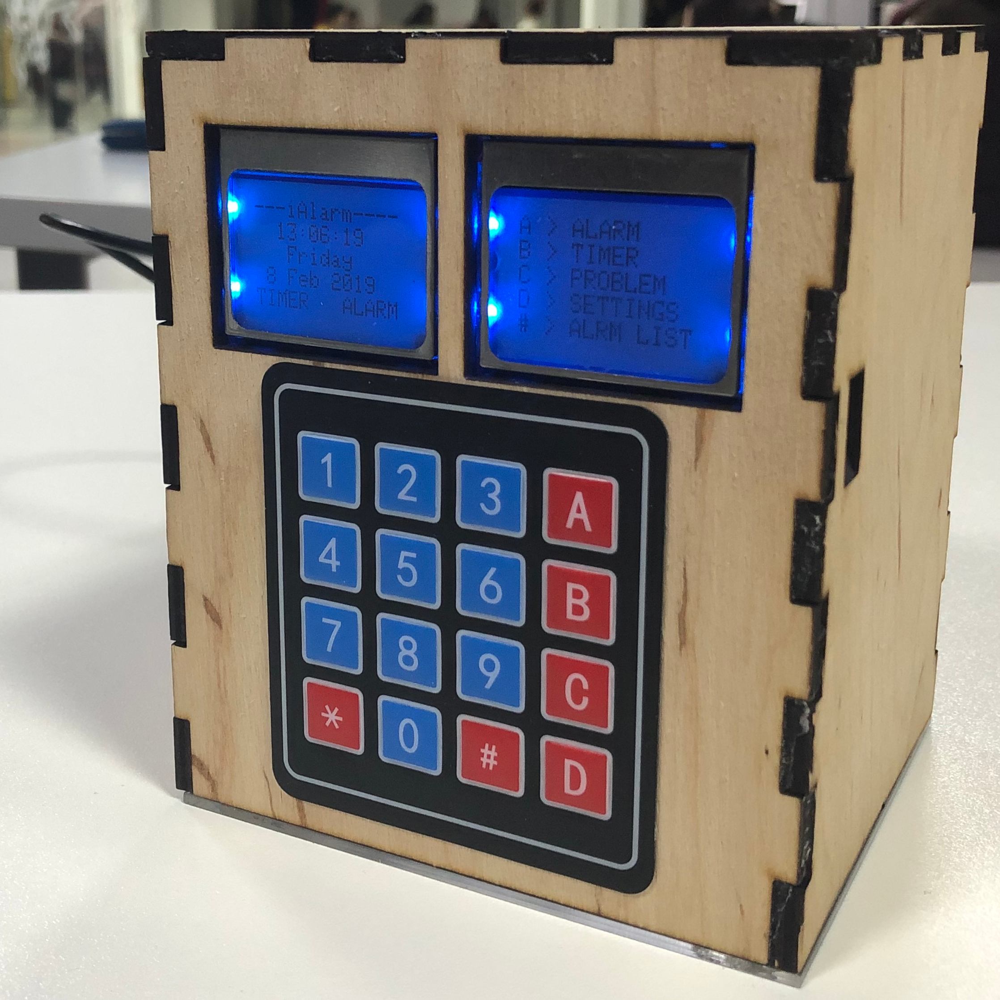
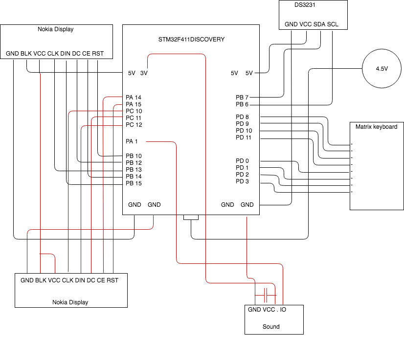

#  :alarm_clock: iAlarm  :alarm_clock:
> WAKE UP SMARTER

[](https://forthebadge.com)
[](https://forthebadge.com)

[](http://badges.mit-license.org) 
[](http://makeapullrequest.com)
[](https://github.com/chernetskyi/iAlarm/pulls)
[](https://github.com/chernetskyi/iAlarm/issues)



## Table of contents
 - [Getting started](#getting-started)
   - [Prerequisites](#prerequisites)
   - [Installing](#installing)
   - [Usage](#usage)
 - [Contributing](#contributing)
 - [Team](#team)
 - [License and Copyright](license-and-copyright)

## Getting started

### Prerequisites
| **Component**                 | **function**                            |
|------------------------------	|---------------------------------------	|
| STM32F411 Microcontroller    	| data transfer/processing              	|
| DS3231 Real-time Clock       	| time operations                       	|
| CR2032 3V Battery (optional) 	| additional RTC power supply           	|
| 2 Nokia LCD5110 Displays     	| visual information output             	|
| 4x4 Matrix Keyboard          	| user input                            	|
| Buzzer Module                	| audio output                          	|
| Mini-USB Cable               	| first-time code upload / power supply 	|
  
### Installing
  1. Clone project.
  ```bash
  $ git clone https://github.com/chernetskyi/iAlarm  
  ```
  2. Connect the components in the following way:  Connect the STM32 microcontroller to your computer.
  3. Open the project from the `code` folder in the System Workbench or Keil.
  4. Build and run the project.
  5. Enjoy! :tada:

### Usage 
User interface is pretty intuitive: just follow the instructions on one of the displays. For detailed usage guide see [datasheet](iAlarmDataSheet.pdf).

## Contributing :octocat:
Pull requests are welcome. For major changes, please open an issue first to discuss what you would like to change.

## Team
| **Volodymyr Chernetskyi** | **Hermann Yavorskyi** | **Serhii Rosovskyi** |
| :---: |:---:| :---:|
| [chernetskyi](https://github.com/chernetskyi) | [wardady](https://github.com/wardady) | [Rosovskyy](https://github.com/Rosovskyy) |

See also the list of [contributors](https://github.com/chernetskyi/iAlarm/contributors) who participated in this project.

## License and Copyright
[](http://badges.mit-license.org) 

This project is licensed under the [MIT License](https://choosealicense.com/licenses/mit/).

© 2019 Volodymyr Chernetskyi, Hermann Yavorskyi, Serhii Rosovskyi
 
